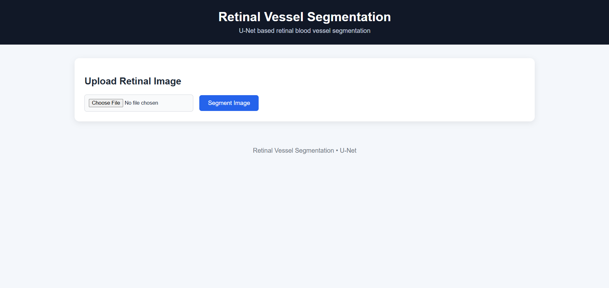
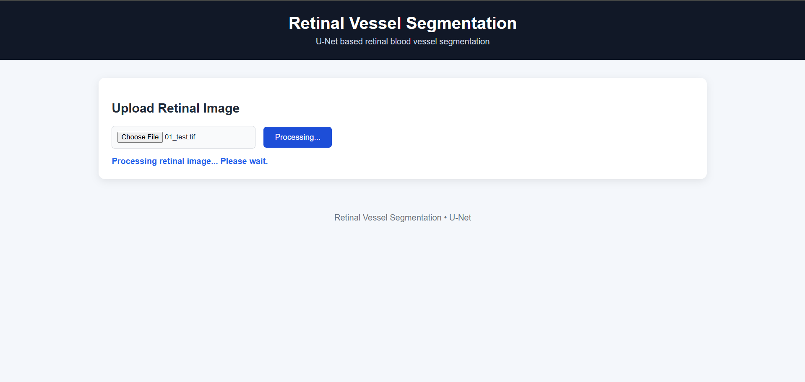
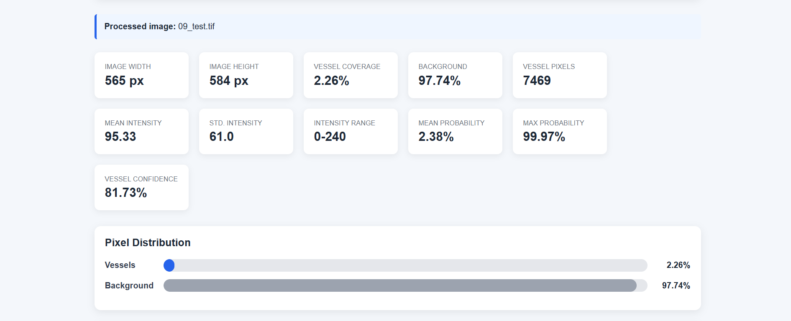
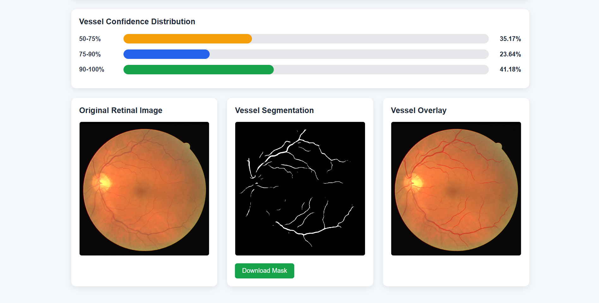

# Retinal Vessel Segmentation

A U-Net based retinal blood vessel segmentation system using the DRIVE retinal fundus dataset, with a Django web interface for image upload, segmentation, visualization, and analysis.

## Dataset

DRIVE retinal fundus dataset.

- Training images: 20
- Evaluation images: 20
- Test images: 20

## Preprocessing

- Green-channel extraction
- CLAHE enhancement
- FOV masking
- Normalization
- 64x64 patch generation

## Model

U-Net for binary retinal vessel segmentation.

- Training epochs: 30
- Best checkpoint: epoch 24
- Inference device: CPU
- Patch size: 64x64
- Patch stride: 16

## Threshold Optimization

The inference threshold was evaluated on all 20 available DRIVE training images using thresholds from 0.05 to 0.50.

The best threshold by Dice score was:

- Threshold: 0.50
- Dice: 82.63%
- IoU: 70.46%
- Precision: 82.27%
- Recall: 83.26%
- Accuracy: 96.99%

The selected inference threshold is therefore **0.50**.

## Test Predictions

All 20 DRIVE test images were processed successfully.

Predicted vessel coverage ranged from approximately 7.29% to 10.87%.

## Web Application

A Django web application is included for interactive inference.

The application provides:

- Retinal image upload
- U-Net vessel segmentation
- Original image display
- Binary segmentation mask
- Vessel overlay visualization
- Vessel coverage statistics
- Pixel intensity statistics
- Model probability statistics
- Vessel confidence distribution
- Segmentation mask download

Run the development server:

    python manage.py runserver

Then open:

    http://127.0.0.1:8000/

## Project Structure

- `src/` - model training, preprocessing, evaluation, and test prediction
- `segmentation/` - Django segmentation application and inference
- `webapp/` - Django project configuration
- `data/` - datasets and processed data
- `checkpoints/` - trained model checkpoint
- `outputs/` - generated predictions
- `results/` - result files
- `screenshots/` - selected project screenshots
- `requirements.txt` - Python dependencies

## Reproducibility

Install dependencies:

    pip install -r requirements.txt

Train the model:

    python src/train.py

Evaluate the model:

    python src/evaluate.py

Generate DRIVE test predictions:

    python src/predict_test.py

Run Django:

    python manage.py runserver

## Current Status

The complete pipeline is operational:

1. DRIVE dataset
2. Preprocessing
3. Patch generation
4. U-Net training
5. Threshold optimization
6. Test prediction
7. Django inference
8. Segmentation visualization and statistics
9. Automated Django tests

## Output Screenshots

